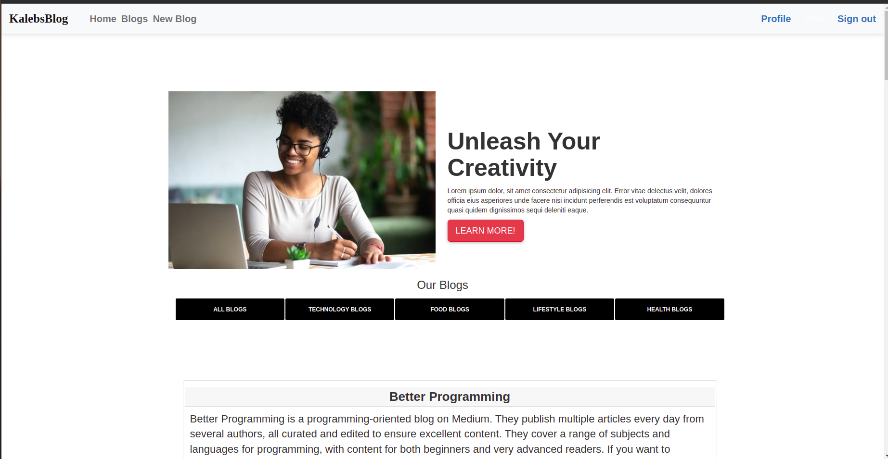

## Description

This is a personal blogging website where we create and share opinions and our users can read and comment on them. Additionally, we displays random quotes to inspire our users.

## Author

[Caleb Kabaya](https://github.com/CalebKabaya)

## Live Link
[View Site](https://kalebsblog.herokuapp.com/)

## Screenshots

```
Landing Page
```


## User Story

* A user can view the most recent posts.
* View and comment the blog posts on the site.
* A user should an email alert when a new post is made by joining a subscription.
* Register to be allowed to log in to the application
* A user sees random quotes on the site
* A writer can create a blog from the application and update or delete blogs I have created.

## BDD
| Behaviour | Input | Output |
| :---------------- | :---------------: | ------------------: |
| Load the page | **On page load** | Get all blogs, Select between signup and login|
| Select SignUp| **Email**,**Username**,**Password** | Redirect to login|
| Select Login | **Username** and **password** | Redirect to page with blogs that have been posted by writes and be able to subscribe to the blog|
| Select comment button | **Comment** | Form that you input your comment|
| Click on submit |  | Redirect to all comments tamplate with your comment and other comments|
|Subscription | **Email Address**| Flash message "Succesfully subsbribed to KalebsBlog"|


### Running the Application

1. Pre-requisites

   - Ensure to activate virtual environment called virtual,using:

     - source virtual/bin/activate

   - Install flask and pip
   - Install flask_script

2. Inside the manage.py module change the config_name parameter from 'production' to 'development' ie app = create_app('production') should be app = create_app ('development')
3. Add the export configurations in a start.sh

   - export SECRET_KEY= "Your secret key"
   - export API_KEY= "Your Api key"

4. Run using the executable file ,with command :
   - ./start.sh

## Contact Information

For any further inquiries or contributions or comments, reach me at [Caleb Kabaya](https://github.com/CalebKabaya)

## Licence

[MIT](LICENSE)


[Go Back to the top](#description)

## Authors Info
Linked - Caleb Kabaya(hhttps://www.linkedin.com/in/caleb-kabaya-167676195/)

Email - (calebkabaya7@gmail.com)

[Go Back to the top](#description)
